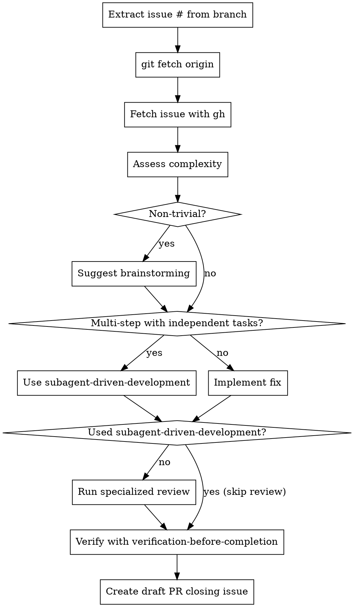

# Fix GitHub Issue

## Overview

Automates the workflow for fixing GitHub issues on branches named `fix-NNN`. Extracts issue number, fetches details with `gh`, assesses complexity, guides through resolution with appropriate skills, runs specialized code review (if not using subagent-driven-development), and creates draft PR that closes the issue.

## When to Use

Use this skill when:
- Ready to start fixing a GitHub issue
- Want structured workflow from issue lookup to PR

**Issue number resolution:**
1. If an issue number is passed to the skill, use that
2. Otherwise, extract from branch name (`fix-978` -> `978`)

Don't use when:
- Not working on a GitHub issue
- Just exploring code (use other skills)

## Workflow



### Steps

1. **Get issue number**: Use provided number, or parse from branch name (`fix-978` -> `978`)

2. **Update remote state**:
   ```bash
   git fetch origin
   ```
   This ensures we have the latest main branch for accurate diff comparisons.

3. **Fetch issue**:
   ```bash
   gh issue view 978
   ```

4. **Assess complexity**:

   | Trivial | Non-trivial |
   |---------|-------------|
   | Single file | Multiple files |
   | < 10 lines | > 10 lines |
   | Obvious fix | Requires decisions |
   | No tests needed | Tests required |

   **When in doubt, treat as non-trivial**

5. **For non-trivial issues**:
   - Present summary to user
   - Say: "This issue involves [complexity]. Should we brainstorm approaches first?"
   - Use `superpowers:brainstorming` if user agrees

6. **Choose implementation approach**:
   - **Multiple independent tasks**: Use `superpowers:subagent-driven-development`
   - **Needs design/planning**: Use `superpowers:writing-plans` first
   - **Single cohesive task**: Implement directly

7. **Code Review (conditional)**:
   - **If you used `subagent-driven-development`**: Skip review (already reviewed between tasks)
   - **If direct implementation**: Run specialized review based on changes:

     | Change Type | Review Command | Use When |
     |-------------|----------------|----------|
     | Frontend (HTML/CSS/templates/JS) | `/frontend-review` | UI changes, accessibility, responsive design |
     | Security (auth/sessions/data) | `/security-review` | Authentication, authorization, data handling |
     | Playwright tests | `/playwright-review` | E2E test changes, test performance |
     | Other/general changes | `/request-review` | General code review |

   - **REQUIRED**: Fix all Important issues before proceeding
   - Minor issues can be noted for later

8. **Verify fix**:
   - **REQUIRED**: Use `superpowers:verification-before-completion`
   - Never skip verification

9. **Create Draft PR**:
   ```bash
   gh pr create --draft \
                --title "Fix: [issue title]" \
                --body "Closes #978

   ## Changes
   - [What changed]

   ## Testing
   - [How verified]"
   ```

   **Note**: Creates a draft PR so you can review before marking ready.

## Common Mistakes

| Mistake | Fix |
|---------|-----|
| Skip git fetch | Always fetch origin - branch may be behind |
| Skip fetching issue | Always fetch - may have updates |
| Jump into complex fix | Suggest brainstorming for non-trivial |
| Skip review for direct implementation | If no subagent-driven-development, run specialized review |
| Wrong reviewer for changes | Frontend changes need frontend-review, security needs security-review |
| Skip verification | Always verify before PR |
| Wrong issue # in PR | Double-check branch name parsing |
| "I'll just fix it quickly" for big changes | Use proper workflow |

## Red Flags

- Skipping git fetch -> Branch may be stale, diffs will be confusing
- "Don't need brainstorming" for >10 line change -> Probably not trivial
- "Don't need review" for direct implementation -> If no subagent-driven-development, review is required
- Skipping review because "it's simple" -> Simple frontend changes can have accessibility issues
- Using wrong reviewer -> Match reviewer to change type (frontend/security/playwright/general)
- Creating PR before verification -> Verify first, always
- Skipping issue fetch "to save time" -> Always get latest context
- "It's obvious" for multi-file changes -> Use brainstorming
- Creating ready-for-review PR -> Use draft PR, mark ready after review

## Related Skills & Commands

**Superpowers plugin:**
- **REQUIRED**: `superpowers:verification-before-completion` before PR
- **Recommended for non-trivial**: `superpowers:brainstorming`
- **Recommended for multi-task**: `superpowers:subagent-driven-development` (includes built-in review)
- **Recommended for complex**: `superpowers:writing-plans`

**Kitchen-sink specialized reviews (for direct implementations):**
- `/frontend-review` - HTML/CSS/templates/accessibility/responsive design
- `/security-review` - Authentication/authorization/PII/OWASP Top 10
- `/playwright-review` - E2E tests/ARIA verification/performance optimization
- `/request-review` - General code review for other changes
