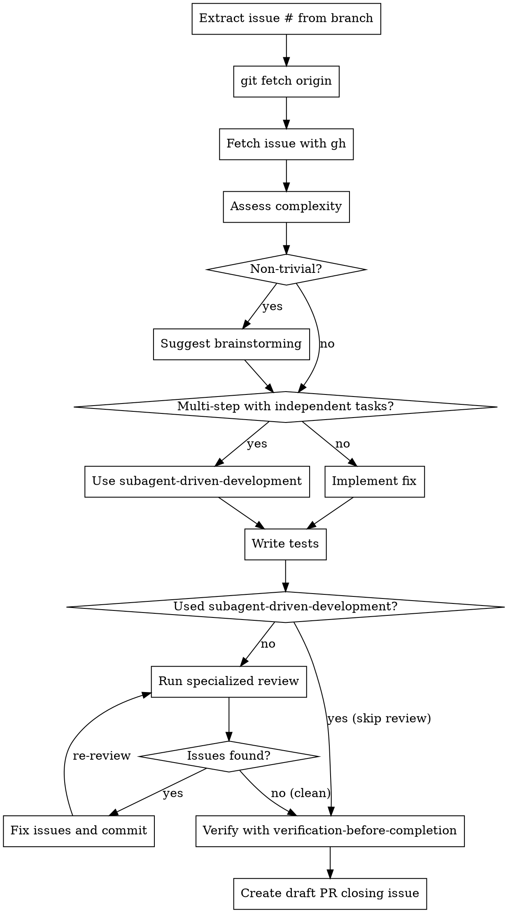

# Fix GitHub Issue

## Overview

Automates the workflow for fixing GitHub issues on branches named `fix-NNN`. Extracts issue number, fetches details with `gh`, assesses complexity, guides through resolution with appropriate skills, runs specialized code review (if not using subagent-driven-development), and creates draft PR that closes the issue.

## When to Use

Use this skill when:
- Ready to start fixing a GitHub issue
- Want structured workflow from issue lookup to PR

**Issue number resolution:**
1. If an issue number is passed to the skill, use that
2. Otherwise, extract from branch name (`fix-978` -> `978`)

Don't use when:
- Not working on a GitHub issue
- Just exploring code (use other skills)

## Dispatch the file-heavy work to a subagent (reviews stay in the caller)

For the **direct implementation** branch (i.e. when `superpowers:subagent-driven-development` is not chosen), dispatch the bulky file editing — implementation and the test-writing / test-running cycle — to a `general-purpose` subagent via the `Agent` tool. **Keep the review fan-out and the fix-and-re-review loop in the caller's context.**

**Why this split (read before changing it):** a subagent has no `Agent`/`Task` tool — it cannot spawn another subagent. The specialized reviewers (`/security-review`, `/frontend-review`, `/request-review`, etc.) each spawn the `superpowers:code-reviewer` subagent internally, so they only work where nested delegation is available: the caller. Asking the dispatched subagent to run them makes the reviews silently degrade or fail, and you end up re-running them in the caller anyway. The same applies to any other delegating skill (e.g. a test runner that fans out to subagents) — those must run in the caller too.

What stays in the caller's context (interactive / decisional / delegating):
- Issue number resolution and `gh issue view`
- Complexity assessment
- The "should we brainstorm?" decision and `superpowers:brainstorming` itself
- The choice of implementation approach (SDD vs `writing-plans` vs direct)
- The specialized review fan-out (step 8) — these spawn `code-reviewer`, which needs the caller's `Agent` tool
- The fix-and-re-review loop: read each review, dispatch the fixes down to a subagent, re-run the **same** reviewer(s) against the new HEAD SHA, repeat until clean
- `superpowers:verification-before-completion` (step 9) and draft PR creation (step 10)

What the subagent runs:
- Implementation edits (step 7)
- The test-writing / test-running cycle (step 7)
- Each round of review fixes when the caller dispatches them back (step 8's fix step)

The subagent returns — not its intermediate reads/edits — the changed files (or a diff), the test command and its result, the HEAD SHA, and a one-line summary.

Why split it this way:
- The implement / test / fix loop reads, edits, and runs tests across many files. None of that intermediate state is useful to the caller. Keeping it in a subagent prevents a single issue from filling the caller's context window.
- Reviews run as `code-reviewer` subagents, so their bulk lands in *those* contexts, not the caller's — the caller only holds the review reports and orchestration. Running them in the caller costs little context and is the only place they can run at all.

How to dispatch the implementation:
- Brief the subagent with this command file as its working spec, plus: the issue number, the brainstorming output (if any), the chosen approach, the branch name, and the working directory.
- Scope it to **step 7 only** (implement + tests). Tell it explicitly NOT to invoke `/frontend-review`, `/security-review`, `/request-review`, or any other delegating command — those run in the caller.
- Require it to report back, in under 200 words: the changed files (or diff), the test command + result, the HEAD SHA, and a one-line summary.
- For each fix round, re-dispatch a subagent with the review findings; have it apply and commit the fixes, then report the new HEAD SHA. If a review surfaces an issue you're unsure how to resolve (e.g. a Minor flag that looks counterproductive), stop and surface the decision to the user rather than guess.

If the user explicitly asks to run inline (e.g. "do it here so I can watch"), or the chosen approach is `superpowers:subagent-driven-development` (already in fresh subagent contexts), skip this dispatch.

## Workflow


```dot
digraph fix_issue {
    "Extract issue # from branch" [shape=box];
    "git fetch origin" [shape=box];
    "Fetch issue with gh" [shape=box];
    "Assess complexity" [shape=box];
    "Non-trivial?" [shape=diamond];
    "Suggest brainstorming" [shape=box];
    "Multi-step with independent tasks?" [shape=diamond];
    "Use subagent-driven-development" [shape=box];
    "Implement fix" [shape=box];
    "Write tests" [shape=box];
    "Used subagent-driven-development?" [shape=diamond];
    "Run specialized review" [shape=box];
    "Issues found?" [shape=diamond];
    "Fix issues and commit" [shape=box];
    "Verify with verification-before-completion" [shape=box];
    "Create draft PR closing issue" [shape=box];

    "Extract issue # from branch" -> "git fetch origin";
    "git fetch origin" -> "Fetch issue with gh";
    "Fetch issue with gh" -> "Assess complexity";
    "Assess complexity" -> "Non-trivial?";
    "Non-trivial?" -> "Suggest brainstorming" [label="yes"];
    "Non-trivial?" -> "Multi-step with independent tasks?" [label="no"];
    "Suggest brainstorming" -> "Multi-step with independent tasks?";
    "Multi-step with independent tasks?" -> "Use subagent-driven-development" [label="yes"];
    "Multi-step with independent tasks?" -> "Implement fix" [label="no"];
    "Use subagent-driven-development" -> "Write tests";
    "Implement fix" -> "Write tests";
    "Write tests" -> "Used subagent-driven-development?";
    "Used subagent-driven-development?" -> "Verify with verification-before-completion" [label="yes (skip review)"];
    "Used subagent-driven-development?" -> "Run specialized review" [label="no"];
    "Run specialized review" -> "Issues found?" [shape=diamond];
    "Issues found?" -> "Fix issues and commit" [label="yes"];
    "Fix issues and commit" -> "Run specialized review" [label="re-review"];
    "Issues found?" -> "Verify with verification-before-completion" [label="no (clean)"];
    "Verify with verification-before-completion" -> "Create draft PR closing issue";
}
```

### Steps

1. **Get issue number**: Use provided number, or parse from branch name (`fix-978` -> `978`)

2. **Update remote state**:
   ```bash
   git fetch origin
   ```
   This ensures we have the latest main branch for accurate diff comparisons.

3. **Fetch issue**:
   ```bash
   gh issue view 978 --json body,title
   ```

4. **Assess complexity**:

   | Trivial | Non-trivial |
   |---------|-------------|
   | Single file | Multiple files |
   | < 10 lines | > 10 lines |
   | Obvious fix | Requires decisions |
   | No tests needed | Tests required |

   **When in doubt, treat as non-trivial**

5. **For non-trivial issues**:
   - Present summary to user
   - Say: "This issue involves [complexity]. Should we brainstorm approaches first?"
   - Use `superpowers:brainstorming` if user agrees

6. **Choose implementation approach**:
   - **Multiple independent tasks**: Use `superpowers:subagent-driven-development`
   - **Needs design/planning**: Use `superpowers:writing-plans` first
   - **Single cohesive task**: Implement directly

7. **Write tests**:
   - **REQUIRED**: Every fix must include tests unless the change is purely cosmetic (typo, whitespace, comment-only)
   - Write tests that fail without the fix and pass with it
   - If the project has an existing test suite, follow its patterns and conventions
   - Run the test suite to confirm all tests pass (both new and existing)

8. **Code Review (conditional)**:
   - **If you used `subagent-driven-development`**: Skip review (already reviewed between tasks)
   - **If direct implementation**: Run specialized review based on changes:

     | Change Type | Review Command | Use When |
     |-------------|----------------|----------|
     | Frontend (HTML/CSS/templates/JS) | `/frontend-review` | UI changes, accessibility, responsive design |
     | Security (auth/sessions/data) | `/security-review` | Authentication, authorization, data handling |
     | Playwright tests | `/playwright-review` | E2E test changes, test performance |
     | SEO (meta tags/headings/URLs/structured data) | `/seo-review` | Pages, routes, Open Graph, schema markup |
     | Other/general changes | `/request-review` | General code review |

   - **Multiple reviewers**: If changes span categories (e.g., frontend + SEO), run each applicable reviewer
   - **REQUIRED: Fix-and-re-review loop**:
     1. Run the applicable specialized reviewer(s)
     2. Fix all Critical, Important, AND Minor issues found
     3. **Exception**: If the diff is over 500 lines, fix Critical and Important issues in the branch but create GitHub issues for Minor ones so they don't get lost
     4. If a Minor issue seems wrong or counterproductive, push back on it rather than blindly implementing — but default to fixing it since it's usually less overhead than creating a follow-up issue
     5. Commit fixes with a clear message referencing the review
     6. Re-run the **same specialized reviewer(s)** with updated HEAD SHA
     7. Repeat until the review passes clean
   - Do NOT skip re-review — the specialized checklists (accessibility, OWASP, SEO) catch things the generic reviewer misses
   - Do NOT substitute `/request-review` for a specialized reviewer when a specialized one applies

9. **Verify fix**:
   - **REQUIRED**: Use `superpowers:verification-before-completion`
   - Never skip verification

10. **Create Draft PR**:
   ```bash
   gh pr create --draft \
                --title "Fix: [issue title]" \
                --body "Closes #978

   ## Changes
   - [What changed]

   ## Testing
   - [How verified]"
   ```

   **Note**: Creates a draft PR so you can review before marking ready.

## Common Mistakes

| Mistake | Fix |
|---------|-----|
| Skip git fetch | Always fetch origin - branch may be behind |
| Skip fetching issue | Always fetch - may have updates |
| Jump into complex fix | Suggest brainstorming for non-trivial |
| Skip review for direct implementation | If no subagent-driven-development, run specialized review |
| Wrong reviewer for changes | Frontend changes need frontend-review, security needs security-review |
| Fix issues but skip re-review | Always re-run the same specialized reviewer(s) after fixes |
| Use /request-review when specialized applies | Specialized reviewers have domain checklists the generic one lacks |
| Skip verification | Always verify before PR |
| Wrong issue # in PR | Double-check branch name parsing |
| "I'll just fix it quickly" for big changes | Use proper workflow |
| Skipping tests | Every non-cosmetic fix needs tests that fail without it |
| Writing tests after review flags it | Write tests as part of implementation, not as review remediation |

## Red Flags

- Skipping git fetch -> Branch may be stale, diffs will be confusing
- "Don't need brainstorming" for >10 line change -> Probably not trivial
- "Don't need review" for direct implementation -> If no subagent-driven-development, review is required
- Skipping review because "it's simple" -> Simple frontend changes can have accessibility issues
- Using wrong reviewer -> Match reviewer to change type (frontend/security/playwright/general)
- Skipping re-review after fixes -> Fixes can introduce new issues; always re-review with the same specialized reviewer
- Using generic /request-review for frontend/SEO/security -> Specialized checklists catch domain-specific issues
- Creating PR before verification -> Verify first, always
- Skipping issue fetch "to save time" -> Always get latest context
- "It's obvious" for multi-file changes -> Use brainstorming
- Creating ready-for-review PR -> Use draft PR, mark ready after review
- "No tests needed" for a code change -> If it changes behavior, it needs tests

## Related Skills & Commands

**Superpowers plugin:**
- **REQUIRED**: `superpowers:verification-before-completion` before PR
- **Recommended for non-trivial**: `superpowers:brainstorming`
- **Recommended for multi-task**: `superpowers:subagent-driven-development` (includes built-in review)
- **Recommended for complex**: `superpowers:writing-plans`

**Kitchen-sink specialized reviews (for direct implementations):**
- `/frontend-review` - HTML/CSS/templates/accessibility/responsive design
- `/security-review` - Authentication/authorization/PII/OWASP Top 10
- `/playwright-review` - E2E tests/ARIA verification/performance optimization
- `/request-review` - General code review for other changes
