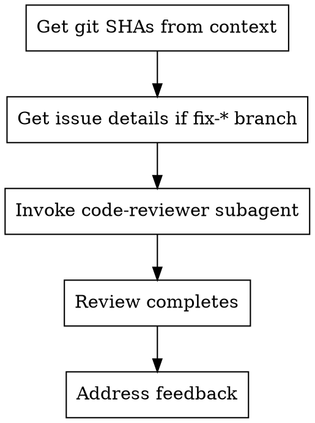

# Code Review

## Overview

Streamlined code review workflow that gets git SHAs from context and invokes `superpowers:code-reviewer` without blocking on permission prompts. This allows you to leave the window while the review runs unattended.

## When to Use

Use this command when:
- You've completed a feature or bug fix
- Before merging to main
- After a major code change
- When you want a fresh perspective on your work

Don't use when:
- No code has been written yet
- Just starting work on an issue

## Workflow



## Steps

### 1. Get Git SHAs

**First, check conversation context** (no Bash needed):
- Base SHA: Look for recent `git log` output, gitStatus, or known commit reference
- Head SHA: Shown in your own `git commit` output or recent git commands

**If not in context, run separate git commands:**
```bash
# Run these as SEPARATE tool calls, not chained
git rev-parse origin/main  # or HEAD~1, or specific commit
git rev-parse HEAD
```

**DON'T do this** (triggers permission prompts):
```bash
# ❌ Compound command
BASE_SHA=$(git rev-parse origin/main) && HEAD_SHA=$(git rev-parse HEAD) && echo "BASE=$BASE_SHA"
```

### 2. Determine What Was Implemented

**If on a fix-NNN branch:**
- Extract issue number from branch name: `fix-978` -> `978`
- Fetch issue details:
  ```bash
  gh issue view 978 --json title,body
  ```
- Use issue title/body for requirements

**Otherwise:**
- Use commit messages or context from conversation
- Ask user for summary if unclear

### 3. Invoke Code Reviewer

Use Task tool with `superpowers:code-reviewer` subagent:

```
Task(superpowers:code-reviewer):
  description: Review [feature/fix name]

  prompt:
    # Code Review Agent

    You are reviewing code changes for production readiness.

    **Your task:**
    1. Review [what was implemented]
    2. Compare against [requirements/issue]
    3. Check code quality, architecture, testing
    4. Categorize issues by severity
    5. Assess production readiness

    ## What Was Implemented

    [Brief summary - e.g., "Fixed tag sorting to handle distance tags with different units"]

    ## Requirements/Plan

    [Issue details or requirements - e.g., "Issue #1065: Tags should sort by actual distance value, not alphabetically"]

    ## Git Range to Review

    **Base:** [base_sha]
    **Head:** [head_sha]

    ```bash
    git diff --stat [base_sha]..[head_sha]
    git diff [base_sha]..[head_sha]
    ```

    ## Review Checklist

    **Code Quality:**
    - Clean separation of concerns?
    - Proper error handling?
    - Type safety (if applicable)?
    - DRY principle followed?
    - Edge cases handled?

    **Architecture:**
    - Sound design decisions?
    - Scalability considerations?
    - Performance implications?
    - Security concerns?

    **Testing:**
    - Tests actually test logic (not mocks)?
    - Edge cases covered?
    - Integration tests where needed?
    - All tests passing?

    **Requirements:**
    - All plan requirements met?
    - Implementation matches spec?
    - No scope creep?
    - Breaking changes documented?

    **Production Readiness:**
    - Migration strategy (if schema changes)?
    - Backward compatibility considered?
    - Documentation complete?
    - No obvious bugs?

    ## Output Format

    ### Strengths
    [What's well done? Be specific.]

    ### Issues

    #### Critical (Must Fix)
    [Bugs, security issues, data loss risks, broken functionality]

    #### Important (Should Fix)
    [Architecture problems, missing features, poor error handling, test gaps]

    #### Minor (Nice to Have)
    [Code style, optimization opportunities, documentation improvements]

    **For each issue:**
    - File:line reference
    - What's wrong
    - Why it matters
    - How to fix (if not obvious)

    ### Recommendations
    [Improvements for code quality, architecture, or process]

    ### Assessment

    **Ready to merge?** [Yes/No/With fixes]

    **Reasoning:** [Technical assessment in 1-2 sentences]

    ## Critical Rules

    **DO:**
    - Categorize by actual severity (not everything is Critical)
    - Be specific (file:line, not vague)
    - Explain WHY issues matter
    - Acknowledge strengths
    - Give clear verdict

    **DON'T:**
    - Say "looks good" without checking
    - Mark nitpicks as Critical
    - Give feedback on code you didn't review
    - Be vague ("improve error handling")
    - Avoid giving a clear verdict
```

### 4. After Review Completes

The subagent will return a detailed review report. Then:

1. **Use `superpowers:receiving-code-review`** to handle feedback properly
2. **Address Critical issues** immediately
3. **Address Important issues** before merging
4. **Note Minor issues** for later or create follow-up issues

## Common Mistakes

| Mistake | Fix |
|---------|-----|
| Using compound commands for SHAs | Check context first, or run git commands separately |
| Not checking conversation context | SHAs usually visible in recent git output |
| Skipping issue fetch on fix-* branch | Always get context for proper review |
| Requesting review before committing | Commit first, then review |
| Ignoring review feedback | Use receiving-code-review skill to evaluate properly |

## Benefits

✅ **No permission prompts** - Uses context or simple git commands
✅ **Unattended execution** - Can leave window while review runs
✅ **Structured feedback** - Consistent categorization (Critical/Important/Minor)
✅ **Faster workflow** - No blocking on permissions

## Example

```
User: /code-review

Step 1: Check context
- Recent commit showed: [fix-1065 d0e856b8]
- git log shows base: 4f940124
- Branch name: fix-1065

Step 2: Get issue details
$ gh issue view 1065 --json title,body
Issue: "listed tag order - tags should sort by actual distance"

Step 3: Invoke code-reviewer
Task(superpowers:code-reviewer):
  WHAT_WAS_IMPLEMENTED: Tag sorting with distance unit handling
  PLAN_OR_REQUIREMENTS: Issue #1065 - sort by actual distance value
  BASE_SHA: 4f940124
  HEAD_SHA: d0e856b8
  DESCRIPTION: Added parseDistanceTag() and case-insensitive regex

Step 4: Review returns
- Strengths: Good test coverage, clean architecture
- Important: Case-insensitive regex missing
- Assessment: Ready with fixes

Step 5: Address feedback
[Use receiving-code-review skill to evaluate and implement]
```

## Related Skills

- **superpowers:code-reviewer** - The subagent this command invokes
- **superpowers:receiving-code-review** - How to handle review feedback
- **code-review-flow** - The skill documenting this pattern
