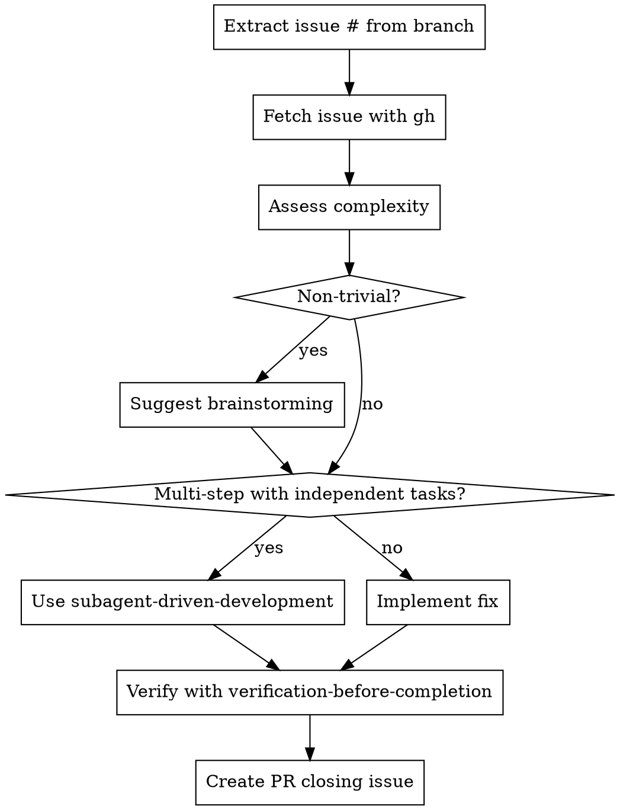

# Fix Issue

## Overview

Automates the workflow for fixing GitHub issues on branches named `fix-NNN`. Extracts issue number, fetches details with `gh`, assesses complexity, guides through resolution with appropriate skills, and creates PR that closes the issue.

## When to Use

Use this skill when:
- Ready to start fixing a GitHub issue
- Want structured workflow from issue lookup to PR

**Issue number resolution:**
1. If an issue number is passed to the skill, use that
2. Otherwise, extract from branch name (`fix-978` -> `978`)

Don't use when:
- Not working on a GitHub issue
- Just exploring code (use other skills)

## Workflow



### Steps

1. **Get issue number**: Use provided number, or parse from branch name (`fix-978` -> `978`)

2. **Fetch issue**:
   ```bash
   gh issue view 978
   ```

3. **Assess complexity**:

   | Trivial | Non-trivial |
   |---------|-------------|
   | Single file | Multiple files |
   | < 10 lines | > 10 lines |
   | Obvious fix | Requires decisions |
   | No tests needed | Tests required |

   **When in doubt, treat as non-trivial**

4. **For non-trivial issues**:
   - Present summary to user
   - Say: "This issue involves [complexity]. Should we brainstorm approaches first?"
   - Use `superpowers:brainstorming` if user agrees

5. **Choose implementation approach**:
   - **Multiple independent tasks**: Use `superpowers:subagent-driven-development`
   - **Needs design/planning**: Use `superpowers:writing-plans` first
   - **Single cohesive task**: Implement directly

6. **Verify fix**:
   - **REQUIRED**: Use `superpowers:verification-before-completion`
   - Never skip verification

7. **Create PR**:
   ```bash
   gh pr create --title "Fix: [issue title]" \
                --body "Closes #978

   ## Changes
   - [What changed]

   ## Testing
   - [How verified]"
   ```

## Common Mistakes

| Mistake | Fix |
|---------|-----|
| Skip fetching issue | Always fetch - may have updates |
| Jump into complex fix | Suggest brainstorming for non-trivial |
| Skip verification | Always verify before PR |
| Wrong issue # in PR | Double-check branch name parsing |
| "I'll just fix it quickly" for big changes | Use proper workflow |

## Red Flags

- "Don't need brainstorming" for >10 line change -> Probably not trivial
- Creating PR before verification -> Verify first, always
- Skipping issue fetch "to save time" -> Always get latest context
- "It's obvious" for multi-file changes -> Use brainstorming

## Related Skills (superpowers plugin)

- **REQUIRED**: `superpowers:verification-before-completion` before PR
- **Recommended for non-trivial**: `superpowers:brainstorming`
- **Recommended for multi-task**: `superpowers:subagent-driven-development`
- **Recommended for complex**: `superpowers:writing-plans`
