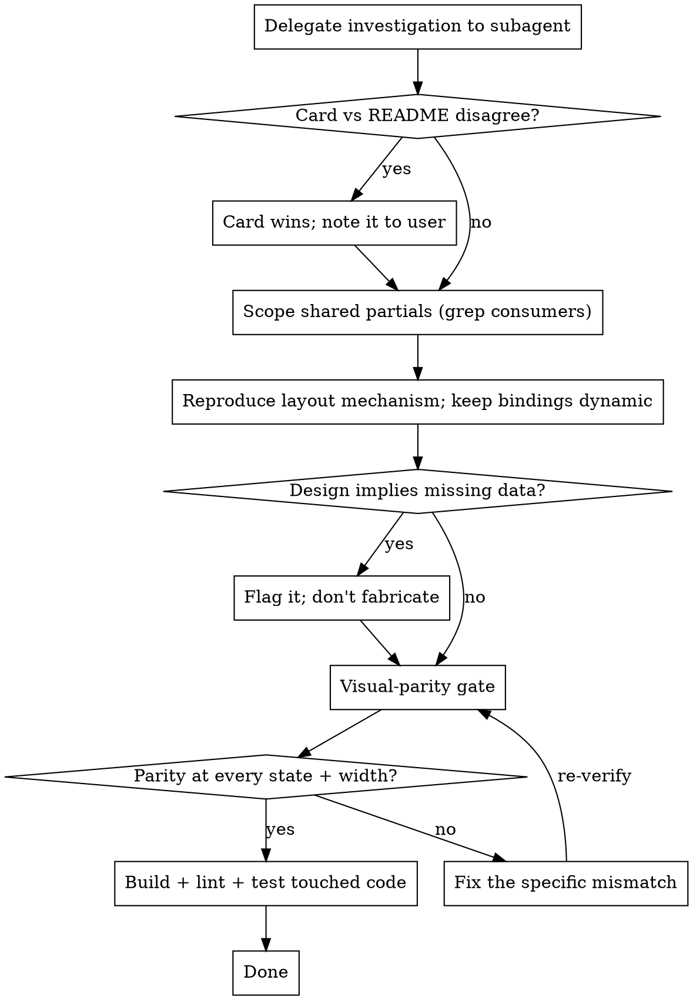

# Implement Design Handoff

## Overview

Wiring a design-system handoff — a rendered component/card export from a design tool — into an app's *real* templates and stylesheet is a recurring, stack-agnostic task with a recurring set of failure modes. The mistakes are predictable, and **the ordering of the steps is what prevents them.**

**Core principle: the rendered card is the source of truth for appearance, and you are not done until you have put the rendered result beside the design, property by property.** A diff looks clean while shipping an oval logo, a search field mashed against the brand, nav links the design shows but the page hid, and a wordmark bolded that the design renders plain. Every one of those is obvious in a five-second side-by-side and invisible in the diff. This skill forces that side-by-side and orders the steps so the cheap mistakes die first.

## When to Use

Use when:
- Implementing a design handoff / component export into real templates and CSS
- "Build this design", "apply the design handoff", wiring `*.card.html` cards + component source into an app
- Writing a GitHub issue that points a *later* implementing agent at a design (the second mode below)

Skip when:
- Greenfield UI with no design-tool export to reproduce faithfully
- Pure logic/data changes with no visual surface

## The Failure Modes (what this skill prevents)

The same handoffs fail the same ways, every time:

- Trusting the handoff's **prose/README** over the **rendered card**.
- Approximating colors and spacing **by eye** instead of using the real tokens.
- Restyling a **shared partial/component** that feeds more than one page, silently changing pages the handoff never mentioned.
- Fighting the screenshot/preview tooling and giving up on visual verification.
- The costliest: **declaring it done before ever putting the rendered result beside the design.**

## Core Principles

1. **The rendered card is the source of truth for appearance — not the README.** Extract *exact* values (px spacing, gap, height, font-size, weight, text-decoration, focus/hover states) from the rendered card and the component source, not from prose. Where README and card disagree, the card wins — and say so to the user rather than silently picking one. READMEs often describe a stale "current state."

2. **Read the component _source_, not only the card.** A card usually just instantiates a component; the real layout (flex structure, which child grows, justification, gaps) lives in the component definition next to it. You cannot reproduce a centered-search masthead from a card screenshot alone.

3. **Reproduce the design's layout _mechanism_, don't reinvent one.** If the design centers a field with `flex:1 1 auto; max-width; margin:0 auto`, do exactly that — don't substitute a different centering trick and hope it lands the same. Mirror the design's element structure.

4. **The design supplies _chrome_, not _content_ — keep content dynamic.** The card's literal text, numbers, lists, and hrefs are sample data. Map them back to the existing template bindings (the variable, the count, the loop); restyle *around* the binding, never replace a binding with the card's placeholder string, and never freeze a loop into a fixed number of hand-written items.

5. **If the design implies data the template doesn't have, flag it — don't fabricate it.** A per-row count or a badge the data has no field for is a data-plumbing question to surface, not a static value to invent.

6. **Scope shared partials safely before editing.** Grep every consumer of the template and every selector you'll touch. To restyle one page only, gate the new markup on a per-page flag set by that page's handler (old markup stays in the `else` branch), and scope new CSS under that page's section so a rule can't leak to other consumers of the same markup.

7. **When the user contradicts the source, the user wins — and note it.** If the component source says a value but the user (looking at the rendered design) says otherwise, match what they see and call out the discrepancy in the PR. Props can render differently from their raw value (font fallback for an unavailable weight, etc.).

8. **Visual-parity gate is the real verification, not a formality** (see below).

9. **Delegate the read-heavy investigation to a subagent.** Pulling every card, extracting tokens, and grepping every consumer can fill the caller's context before a single line is implemented. For anything beyond a small single surface, run the investigation in an `Explore`/`general-purpose` subagent that returns **conclusions, not raw file dumps** (extracted token/style values, the per-surface plan, type/contract facts), written to a brief the caller keeps. **REQUIRED:** reuse `superpowers:dispatching-parallel-agents` discipline for the dispatch.

10. **Build, lint, and test the touched code, then stop.** Run the project's build + formatter/linter + the relevant package tests before declaring done. Exact commands are project-specific and belong in a project-local layer, not in this generic skill.

## Workflow

## Visual-Parity Gate

Capture the rendered result, **read the images yourself**, and compare each one property by property against the design card. This is the verification, not a formality — pair it with `superpowers:verification-before-completion`.

- **Every state, at desktop AND narrow (~390px):** anonymous, authenticated, and any flag-suppressed variant. Also screenshot the surfaces the handoff said to leave alone, to prove no regression.
- **Drive the interactive states a static screenshot can't show:** collapsed mobile menu, focus/focus-within ring, hover, open dropdown. **The menu-open state is the single most-skipped view — verify it explicitly.**
- **Confirm _behaviour_, not just looks:** submit the form and assert the resulting URL so the redesign didn't sever the form contract.
- **Walk an element-by-element checklist:** logo shape, wordmark weight/size/italic, horizontal + vertical centering, every nav link present at that width, inter-item gap, right edge not slammed. Report nothing "done" with a row unchecked.
- **If the tooling is down and you can't produce the side-by-side, say so explicitly** rather than implying you verified it.

## Second Mode: Creating a Handoff Issue

Sometimes the ask is upstream: write a GitHub issue that *points* an implementing agent at a design rather than implementing now.

- **Never sync/copy design files into the issue.** Identify the design by **path** and let the implementer read it at build time; restate the rendered-card-is-truth rule *in the issue*.
- **Map current → target** so the work is scoped: list what renders the thing today, a suggested old→new mapping, every consumer of any shared partial/selector (the blast radius), and known gotchas.
- **Name the dynamic bindings and any new data the design needs** so the implementer restyles around them instead of hardcoding the card's literals.
- **Acceptance = the visual-parity gate**, plus the project's build/lint/test checks.

## Common Pitfalls (universal CSS, framework-neutral)

| Symptom | Cause | Fix |
|---------|-------|-----|
| Round logo renders as an oval | `border-radius: 50%` on a non-square box; a height rule with no matching width while a `width=` attribute stands | Set explicit, equal width and height (and `object-fit: cover`) |
| Focus rings invisible on dark heroes | A dark focus ring vanishes on a dark background | Put focus on the *wrapper* via `:focus-within` with a *light* ring; suppress the inner control's own focus shadow |
| Underlined leading whitespace | A leading space or `&nbsp;` inside an underlined link/button | Provide spacing with flex `gap`/margins, not characters |
| Centered field hugging its neighbor | A sibling carries the row's free space (`flex-grow`), so the child can't center | Make elements siblings in one flex row; give the centered child `flex:1 1 auto; max-width; margin:0 auto`; when it's suppressed, drop in an empty `flex:1 1 auto` spacer |
| Last item slammed to the viewport edge | A container rule that sets only `padding-left` drops the right padding | Set symmetric horizontal padding |
| Gap collapses to per-item padding | Treating the design's `gap` as "whatever padding exists" | Set the specific `gap` the design lays items out with |
| Design shows links the page hides | Live template hides some links at certain breakpoints or omits them | "Match the design" includes adding/unhiding them — confirm each link the card shows is present at the width the card shows it |
| Same fake row shipped to every user | Hardcoding the card's sample data | Restyle around the binding; keep the binding |

## Common Mistakes

| Mistake | Fix |
|---------|-----|
| Trusting the README over the rendered card | The card wins; note the discrepancy to the user |
| Reading only the card, not the component source | The layout mechanism lives in the component definition |
| Approximating colors/spacing by eye | Extract the real tokens and px values |
| Restyling a shared partial without grepping consumers | Scope with a per-page flag + section-scoped CSS first |
| Replacing a dynamic binding with the card's literal | Restyle around the binding; never freeze a loop |
| Inventing data the template lacks | Flag it as a data-plumbing question |
| Declaring done without the side-by-side | The visual-parity gate IS the verification |
| Skipping the menu-open state | It's the most-skipped view — verify it explicitly |
| Investigating inline in the caller | Delegate to a subagent that returns conclusions, not file dumps |
| Implying you verified when tooling was down | Say so explicitly |

## Related Skills

- **REQUIRED:** `superpowers:verification-before-completion` before declaring done
- **For the investigation dispatch:** `superpowers:dispatching-parallel-agents`
- **For multi-step builds:** `superpowers:subagent-driven-development`

A project layering on this generic skill should supply its concrete build/lint/test commands, its screenshot tooling, and any framework-specific pitfalls in a project-local layer — keep this skill stack-neutral.
