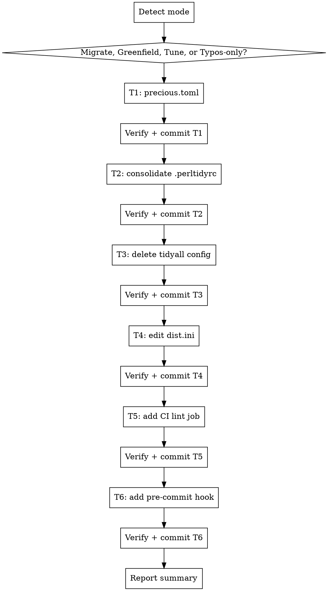

# Tune Precious

## Overview

**Six idempotent transforms that land [precious](https://github.com/houseabsolute/precious) as the canonical tidy/lint driver for a Perl repo (or any repo that has opted into `typos`):**

1. Generate or refresh `precious.toml` with `perltidy`, `perlvars`, `omegasort-gitignore`, `omegasort-stopwords`, optionally `perlcritic`, and optionally `typos`.
2. Consolidate the `perltidy` profile to the hidden `.perltidyrc` and strip `-b` (precious manages backup mode).
3. Delete `Code::TidyAll` config (`.tidyallrc`, `tidyall.ini`, `.tidyall.d/` ignore line).
4. Edit `dist.ini` to remove the tidyall plugin + prereqs via the bundle's `PluginRemover` and a trailing `[RemovePrereqs]` block.
5. Add a `.github/workflows/lint.yml` job that installs `precious` + `omegasort` (+ `typos` when wired) via ubi and runs `precious lint --all`.
6. Add a self-installing `scripts/pre-commit` shell hook that runs `precious lint --staged` and blocks direct commits to the default branch, so contributors catch tidy/lint drift before pushing.

**Core principle:** apply the canonical recipe without changing the user's tidy/lint intent. Each transform is its own commit so any single change is revertable. Re-running on an already-tuned repo is a no-op.

**Four modes** the skill handles transparently:

| Mode | Trigger | What changes |
|---|---|---|
| Migrate | Repo has `.tidyallrc`, `tidyall.ini`, or `[Test::TidyAll]` in `dist.ini` | All six transforms apply |
| Greenfield | Perl repo, no tidyall config, no `precious.toml` | T1 + T2 (consolidate any visible `perltidyrc`) + T5 + T6 |
| Tune | `precious.toml` already exists | All transforms run as no-ops; surfaces drift between current config and canonical recipe |
| Typos-only | No Perl files, but `typos.toml` / `_typos.toml` / `.typos.toml` is present | T1 (typos block only) + T5; T2/T3/T4 are no-ops |

**Worked example PR:** [libwww-perl/WWW-Mechanize-Cached#35](https://github.com/libwww-perl/WWW-Mechanize-Cached/pull/35) — the recipe was extracted from this PR.

## Dispatch this skill to a subagent

When this skill is invoked, dispatch the work to a `general-purpose` subagent via the `Agent` tool. **Do not run the six transforms inline in the caller's context.**

Why:
- Each transform reads several files, computes a diff, writes the files, verifies with `precious config list` / TOML parse / YAML parse / `dzil build --no-tgz`, then stages and commits. Across six transforms and several files, that is a lot of `Read`/`Edit`/`Bash` tool traffic — none of it useful to the caller's session.
- The caller only needs the final summary line (`Applied N transforms across M files in K commits`) and the list of commit SHAs. Everything else is intermediate state.

How to dispatch:
- Brief the subagent with this SKILL.md as its working spec — pass the path to the file or invoke the skill from inside the subagent.
- Tell the subagent the working directory.
- Require the subagent to report back, in under 200 words: the summary line, the per-transform commit SHAs, and any skipped transforms with reason.
- If a transform's verification fails, the subagent must stop and surface the failure rather than continuing or auto-reverting.

If the user explicitly asks to run inline (e.g. "do it here so I can watch"), honour that — the subagent dispatch is the default, not a hard requirement.

## When to Use

- User asks to migrate from `Code::TidyAll` to `precious`
- User asks to set up `precious` from scratch in a Perl repo
- User asks to audit / refresh an existing `precious.toml` against the canonical recipe
- Repo contains `.tidyallrc` or `tidyall.ini`
- `dist.ini` includes `Test::TidyAll`, `[@Author::*]` with a tidyall prereqs block, or `[PerlCritic]` you want to migrate behind precious

**Skip when:**
- Not a Perl repo (no `*.pm`, `*.pl`, `*.t`, `*.psgi`, or `dist.ini`) **and** no typos config (`typos.toml`, `_typos.toml`, `.typos.toml`) at repo root
- The user has deliberately customised `precious.toml` for tools outside the canonical set (e.g. they run `prettier` over Mojolicious templates) — idempotency preserves their commands; only report drift in the six canonical commands.

## Workflow



## Scope Detection

Before running, fingerprint the repo:

| Probe | Implication |
|---|---|
| `.tidyallrc` or `tidyall.ini` present | Mode = migrate; T3 will delete |
| `dist.ini` mentions `Test::TidyAll`, `tidyall`, or has a `[Prereqs / *]` block named for tidyall | Mode = migrate; T4 will rewrite |
| `precious.toml` present | Mode = tune; T1 audits-only and reports drift |
| Neither tidyall nor precious config present, but `*.pm` files exist | Mode = greenfield; T3 + T4 are no-ops |
| `typos.toml`, `_typos.toml`, or `.typos.toml` present at repo root | T1 wires up `typos`; T5 adds `crate-ci/typos` to the ubi `projects:` list |
| No Perl files AND no typos config | Exit cleanly with "no Perl or typos config found" |

`perlcritic` detection (drives whether T1 wires up a `perlcritic` command):

- `.tidyallrc` / `tidyall.ini` has `[PerlCritic]` → auto-enforced; wire up.
- `dist.ini` has `[Test::Perl::Critic]` → auto-enforced; wire up.
- `dist.ini` has `[PerlCritic]` (Dist::Zilla plugin) → auto-enforced; wire up.
- `.perlcriticrc` exists but no auto-enforcement → leave for manual use; do NOT wire up.

**Rule:** don't widen the scan set. If perlcritic wasn't enforced before, precious shouldn't enforce it after.

`typos` detection (drives whether T1 wires up a `typos` command):

- `typos.toml`, `_typos.toml`, or `.typos.toml` exists at repo root → wire up.
- None of the above → do NOT wire up.

**Rule:** only wire `typos` when the user has already opted in by writing a typos config. Don't introduce a new lint dimension on a previously-clean tree.

## The Six Transforms

### 1. Generate or refresh `precious.toml`

**What:** write `precious.toml` at repo root with the canonical commands. Skip blocks whose source file/binary isn't present (no `.stopwords` → skip `omegasort-stopwords`).

**Canonical template:**

```toml
[commands.perltidy]
type    = "both"
include = ["**/*.{pl,pm,t,psgi}"]
cmd     = ["perltidy", "--profile=$PRECIOUS_ROOT/.perltidyrc"]
lint-flags = ["--assert-tidy", "--no-standard-output", "--outfile=/dev/null"]
tidy-flags = ["--backup-and-modify-in-place", "--backup-file-extension=/"]
ok-exit-codes = [0]
lint-failure-exit-codes = [2]

[commands.perlvars]
type    = "lint"
include = ["**/*.pm"]
cmd     = ["perlvars"]
ok-exit-codes = [0]
lint-failure-exit-codes = [1]

[commands.omegasort-gitignore]
type    = "both"
include = [".gitignore"]
cmd     = ["omegasort", "--sort", "path", "--unique"]
lint-flags = ["--check"]
ok-exit-codes = [0]
lint-failure-exit-codes = [1]

[commands.omegasort-stopwords]
type    = "both"
include = [".stopwords"]
cmd     = ["omegasort", "--sort", "text", "--unique"]
lint-flags = ["--check"]
ok-exit-codes = [0]
lint-failure-exit-codes = [1]

# Wired only when perlcritic was already auto-enforced (see scope detection).
[commands.perlcritic]
type    = "lint"
include = ["**/*.{pl,pm,t,psgi}"]
cmd     = ["perlcritic", "--profile=$PRECIOUS_ROOT/.perlcriticrc"]
ok-exit-codes = [0]
lint-failure-exit-codes = [2]

# Wired only when a typos config exists at repo root (see scope detection).
[commands.typos]
type      = "both"
include   = ["**/*"]
invoke    = "once"
path-args = "none"
cmd       = ["typos"]
tidy-flags = ["--write-changes"]
ok-exit-codes = [0]
lint-failure-exit-codes = [2]
```

**Key naming:** precious uses kebab-case for all config keys (`lint-flags`, `tidy-flags`, `ok-exit-codes`, `lint-failure-exit-codes`, `path-args`, `working-dir`, `ignore-stderr`, …). Do NOT use snake_case (`lint_flags`, `ok_exit_codes`) — precious's serde deserializer does not register snake_case aliases and `precious config list` will fail with a parse error.

**Why each block:**

- `perltidy` runs as both tidy and lint. `--assert-tidy` makes lint mode return non-zero when the file would change; `--outfile=/dev/null` keeps lint mode from rewriting. The `--backup-file-extension=/` trick deletes perltidy's `.bak` file by writing it to `/` (a directory perltidy can't open), so tidy mode leaves a clean tree.
- `perlvars` (from `App::perlvars`) is the lint-time replacement for `Code::TidyAll::Plugin::Test::Vars`. Wire it up **even when Test::Vars wasn't previously enforced** — it's cheap, catches unused lexicals, and is the canonical successor.
- `omegasort-gitignore` keeps `.gitignore` sorted and de-duplicated. Sort mode `path` understands directory hierarchy.
- `omegasort-stopwords` keeps `.stopwords` (the Pod::Wordlist source for `Test::Spelling`) sorted and de-duplicated. Sort mode `text`.
- `perlcritic` is only emitted when previously enforced — see Scope Detection above.
- `typos` ([crate-ci/typos](https://github.com/crate-ci/typos)) is a fast, content-agnostic spell checker. `invoke = "once"` + `path-args = "none"` lets typos walk the tree itself, applying its own `.gitignore` + `extend-exclude` logic from the user's `typos.toml`. `--write-changes` is typos' in-place fixer (no path arg needed; works at the tree level). typos exits `0` clean and `2` on findings — matches the exit-code contract used by perltidy. Only emitted when a typos config exists at repo root — see Scope Detection above.

**Idempotency rule (tune mode):** if `precious.toml` already exists, parse it; for each canonical block, if the user's version matches the template exactly, leave it alone; if it differs, report drift (per-key diff) but do not auto-rewrite. Only insert blocks that are missing.

**Verify:** `precious config list` exits 0. If precious isn't on `PATH`, fall back to `python3 -c 'import tomllib; tomllib.loads(open("precious.toml","rb").read().decode())'` for a syntax check.

**dist.ini exclusion (dzil repos only):**

If `dist.ini` exists at repo root, the `precious.toml` you just wrote is a developer-only config and must not ship in the CPAN tarball — exactly the same problem T6 handles for `scripts/pre-commit`. `precious.toml` is a root config file that never belongs in the dist, so prefer `exclude_filename`; fall back to `[PruneFiles]` when `[Git::GatherDir]` is bundle-owned (the common `@Author::*` case, where you can't pass `exclude_filename` from `dist.ini`).

- If `dist.ini` has an explicit, configurable `[Git::GatherDir]` (or `[GatherDir]`) block, add `exclude_filename = precious.toml` to it.
- Otherwise (the `[Git::GatherDir]` is owned by an `[@Author::*]` bundle), append `filename = precious.toml` to the `[PruneFiles]` block. If no `[PruneFiles]` block exists, add one; do NOT introduce a second `[PruneFiles]` section if one already exists.
- **Idempotency:** if `precious.toml` is already excluded — via an `exclude_filename = precious.toml`, a `[PruneFiles] filename = precious.toml`, or a covering `match =` regex (e.g. `match = \.toml$`) — **NO-OP** on the dist.ini edit.
- Skip this sub-step entirely if `dist.ini` does not exist (greenfield / typos-only / non-dzil Perl repo).
- Bundle the dist.ini edit into the same T1 commit as `precious.toml` — they're a logical unit.

After editing `dist.ini`, re-run `dzil build --no-tgz` and confirm `precious.toml` is absent from the build output (`find <DistName>-*/ -name precious.toml` returns nothing). Then revert regenerated build artefacts the way T4 does (`git checkout -- META.json Makefile.PL README.md Changes`; `rm -rf <DistName>-*/ <DistName>-*.tar.gz`).

See the `working-with-dist-zilla` skill's §7 for the canonical exclusion list and the `exclude_filename` vs `[PruneFiles]` decision.

### 2. Consolidate `.perltidyrc`

**What:** ensure the perltidy profile lives at the hidden `.perltidyrc` (what perltidy itself defaults to). Three sub-cases:

| State | Action |
|---|---|
| Only `.perltidyrc` exists | Strip `-b` if present (precious manages backups via `--backup-file-extension=/`). Otherwise no-op. |
| Only `perltidyrc` exists | `git mv perltidyrc .perltidyrc`. Strip `-b`. |
| Both exist | Diff them. The visible `perltidyrc` is usually the tidyall-managed copy, which typically lacks `-b` (tidyall handles backups itself); the hidden `.perltidyrc` is what humans use for manual `perltidy` runs and is more likely to carry `-b`. Keep `.perltidyrc` (after stripping `-b` if present); `git rm perltidyrc`. If the diff shows non-trivial divergence beyond `-b`, stop and surface the diff for human resolution. |
| Neither exists | Greenfield: write a minimal `.perltidyrc` (`-pbp`, `-nst`, `-se` is a common starting point) — but only if the user explicitly asks for greenfield setup. Otherwise skip and warn. |

**Why strip `-b`:** in a tidyall world `-b` told perltidy to write a backup before in-place modification, and tidyall cleaned it up. Under precious, the `--backup-file-extension=/` trick in T1's tidy-flags does the cleanup. Leaving `-b` in the profile creates duplicate-backup confusion.

**Verify:** `perltidy --version` exits 0 with the resolved profile loaded (run `perltidy -DEBUG -dump-options` and grep for the profile path).

**dist.ini exclusion (dzil repos only):** `.perltidyrc` (and any visible `perltidyrc`) is likewise a developer-only config that must not ship to CPAN. In a dzil repo, exclude it the same way T1 excludes `precious.toml` — prefer `exclude_filename` on an explicit `[Git::GatherDir]`, else append to `[PruneFiles]`; NO-OP if it's already excluded. See T1's dist.ini-exclusion sub-step and the `working-with-dist-zilla` skill's §7 for the mechanism and canonical list. Bundle the dist.ini edit into the same T2 commit.

### 3. Delete `Code::TidyAll` config files

**What:**
- `git rm .tidyallrc tidyall.ini` (only the ones present).
- Edit `.gitignore`: remove the `.tidyall.d/` line (and `tidyall.d/` if present without the leading dot). The cache directory is gone with the tidyall plugin.
- If `.tidyall.d/` itself exists in the working tree as a cached directory, `git rm -r .tidyall.d/`.

**Verify:** `git ls-files | grep -E '(^|/)tidyall' || true` returns nothing.

**Critical:** stage the deletions (`git add -u`) before running `dzil build` in T4. `Dist::Zilla::Plugin::Git::GatherDir` reads `git ls-files`; unstaged deletions mean ghost files still appear in the list, and `dzil` errors with `file does not exist`.

### 4. Edit `dist.ini`

Skip this transform entirely if there is no `dist.ini`.

**4a.i. Read the bundle source for plugin/prereqs-block names.**

`dist.ini` usually begins with a single `[@Author::Foo]` line. Find the bundle source:

```bash
perldoc -lm Dist::Zilla::PluginBundle::Author::Foo
```

Read the `configure` / `bundle_config` sub. You're looking for:

- The plugin instance that adds the tidyall test — typically `Test::TidyAll`.
- The named `[ 'Prereqs' => 'NAME' => { ... } ]` block that lists tidyall modules — in `@Author::OALDERS` this is `'Modules for use with tidyall'`. Other bundles pick different names.

**4a.ii. Cross-check the moniker against `META.json` before editing.**

Bundle-author monikers are the highest-risk free-text part of this transform. Capture the pre-edit baseline:

```bash
dzil build --no-tgz
grep -A2 '"develop"' <DistName>-*/META.json | head -30
grep -E '(Code::TidyAll|Test::TidyAll|Test::Vars)' <DistName>-*/META.json
```

If the prereqs you see in the `develop` section don't match the moniker you guessed from the bundle source, fix the moniker before proceeding. After T4 lands, re-running the grep should return nothing.

**4b. Use the bundle's `PluginRemover`:**

```ini
[@Author::Foo]
-remove = Test::TidyAll
-remove = Modules for use with tidyall
```

The first form (`Test::TidyAll`) is a class-name remove and is reliable — it matches `Dist::Zilla::Plugin::Test::TidyAll`. The second form is an instance-name remove against the named Prereqs block; **the moniker is bundle-specific** — if your bundle calls it something else, use that exact string.

**4c. Append `[RemovePrereqs]` after the bundle:**

```ini
[RemovePrereqs]
remove = Code::TidyAll
remove = Code::TidyAll::Plugin::SortLines::Naturally
remove = Code::TidyAll::Plugin::Test::Vars
remove = Code::TidyAll::Plugin::UniqueLines
remove = Test::Code::TidyAll
remove = Test::Vars
remove = Pod::Wordlist
remove = Parallel::ForkManager
```

Two things to remember about `[RemovePrereqs]`:

- **Plugin order matters.** `[RemovePrereqs]` only sees prereqs added by plugins listed earlier in `dist.ini`. The bundle line goes first, `[RemovePrereqs]` second.
- **`remove =` not `-remove =`.** The leading-dash form is for PluginBundle `PluginRemover`; inside `[RemovePrereqs]`, Config::MVP raises `multiple values given for property -remove` on the dash form.

**4d. Add develop-phase prereq for `App::perlvars`:**

```ini
[Prereqs / DevelopRequires]
App::perlvars = 0
```

Append to an existing `[Prereqs / DevelopRequires]` block if one already exists. **Skip this sub-step entirely if `App::perlvars` already appears under `prereqs.develop.requires` in the pre-edit `META.json`** (some bundles inject it themselves; a duplicate is harmless but noisy).

**4e. Run `dzil build --no-tgz` and verify.**

```bash
dzil build --no-tgz
diff -u cpanfile <DistName>-*/cpanfile        # should be empty after edits
grep -E '(Code::TidyAll|Test::TidyAll|Test::Vars|Pod::Wordlist|Parallel::ForkManager)' <DistName>-*/META.json
# above grep should return nothing
```

**4f. Clean up build artefacts before committing.**

`dzil build` regenerates `META.json`, `Makefile.PL`, `README.md`, and friends via `[CopyFilesFromBuild]`. For non-release commits, these are noise — revert them:

```bash
git checkout -- META.json Makefile.PL README.md Changes
rm -rf <DistName>-*/ <DistName>-*.tar.gz
```

Commit only `dist.ini` and `cpanfile`. The next release commit regenerates the rest cleanly.

(See the `working-with-dist-zilla` skill for the broader rationale.)

### 5. Add CI lint job

**What:** add (or update) `.github/workflows/lint.yml`:

**Before emitting the file, resolve the default branch:**

```bash
git symbolic-ref --short refs/remotes/origin/HEAD 2>/dev/null | sed 's@^origin/@@'
```

Substitute the resolved name (or fall back to `main`) into the `branches:` list below. Repos still on `master` need `master` here, or the push trigger silently never fires.

**Before emitting the file, verify every action version.** The `@`-refs in the template below were correct when this skill was written, but action tags move and not every action ever reaches `v1`. For each `uses:` line, resolve a tag that actually exists before writing it:

```bash
gh api repos/<owner>/<repo>/releases/latest --jq .tag_name   # newest release, if the repo cuts releases
gh api repos/<owner>/<repo>/tags --jq '.[].name'             # all tags, for repos with no "latest" release
```

Never assume `@v1`. `oalders/install-ubi-action`, for example, has never tagged a `v1` — its latest is in the `v0.0.x` line, which is why the template pins `@v0.0.6`. When an action only publishes `v0.0.x` tags, pin the exact latest `v0.0.x`; when it publishes a moving major tag (`actions/checkout` → `v6`), that major tag is fine.

```yaml
name: lint

on:
  push:
    branches:
      - main            # ← replace with resolved default branch
  pull_request:
  workflow_dispatch:

concurrency:
  group: ${{ github.workflow }}-${{ github.ref }}
  cancel-in-progress: true

jobs:
  precious:
    runs-on: ubuntu-latest
    steps:
      - uses: actions/checkout@v6
      - uses: shogo82148/actions-setup-perl@v1
        with:
          perl-version: "5.42"
      - uses: oalders/install-ubi-action@v0.0.6   # ← verify the latest tag before writing (see above)
        with:
          GITHUB_TOKEN: ${{ secrets.GITHUB_TOKEN }}
          projects: |
            houseabsolute/precious
            houseabsolute/omegasort
            crate-ci/typos
      - uses: perl-actions/install-with-cpm@v2
        with:
          install: |
            App::perlvars
            Perl::Tidy
          sudo: false
      - run: precious lint --all
```

**Conditional lines:**

- Add the `crate-ci/typos` line to `projects:` **only when T1 wired the `[commands.typos]` block.** Otherwise omit it so the install step doesn't pull a tool the lint run won't use.
- Skip the `shogo82148/actions-setup-perl` and `perl-actions/install-with-cpm` steps entirely in typos-only mode (no Perl files in the repo means there are no CPAN tools to install).

**Why this shape:**

- `precious` is the single entry point — no per-tool step.
- `oalders/install-ubi-action` installs precompiled binaries (precious + omegasort + typos are Rust/Go); skips compile time. The input is `projects:` (newline-delimited list of `owner/repo` slugs passed to `ubi --project`). Always pass `GITHUB_TOKEN: ${{ secrets.GITHUB_TOKEN }}` under `with:` — ubi pulls binaries through the GitHub releases API, and without an authenticated token the unauthenticated rate limit fails the install step intermittently.
- `install-with-cpm@v2` installs the two CPAN tools precious shells out to.
- Perl 5.42 (the current matrix max) is enough for the lint job; nothing in this job exercises older Perls.
- `branches: [<default>]` + workflow-level `concurrency:` block — same conventions as `tune-perl-ci`. Resolve the default branch with the `git symbolic-ref` command shown above and substitute before writing the file.

**Lint job and build jobs:** the generated `lint.yml` is a standalone workflow with no build job, so the `precious` job declares no `needs:`. If you instead add a precious-lint job to a workflow that already contains a build job, that lint job **must** declare `needs: <build-job>` — running lint against a tree whose build is already failing wastes a runner and clutters the failure signal.

**Idempotency:** if `.github/workflows/lint.yml` already exists, parse it. If it already runs `precious lint --all` under the same shape, leave it alone. If the existing file uses a different shape (e.g. installs precious from source), surface the drift and skip — do not overwrite a hand-rolled workflow.

**Verify:** `python3 -c 'import yaml; yaml.safe_load(open(".github/workflows/lint.yml"))'` exits 0; every `uses:` ref in the file resolves to a tag that exists (`gh api repos/<owner>/<repo>/git/refs/tags/<ref>` returns the ref, not a 404).

### 6. Add `scripts/pre-commit` hook for `precious lint`

**What:** add a checked-in shell script at `scripts/pre-commit` that runs `precious lint --staged` and blocks direct commits to the default branch. The script self-installs via `scripts/pre-commit --init`, which symlinks the repo's pre-commit hook to it (resolved via `git rev-parse --git-path hooks` so it works in plain repos and linked worktrees). No external hook framework (no `pre-commit` Python package, no lefthook).

**Canonical script:**

```sh
#!/bin/sh
# Pre-commit hook: enforce `precious lint` on staged files and
# block direct commits to the default branch.
#
# Install (run once per clone):
#   scripts/pre-commit --init

set -eu

if [ "${1:-}" = "--init" ]; then
    repo_root=$(git rev-parse --show-toplevel)
    # Resolve the hooks dir via git so it works in plain repos, linked
    # worktrees (where `.git` is a file pointing into the common git dir),
    # and setups that override `core.hooksPath`. Run with `-C "$repo_root"`
    # so the output is anchored under the worktree root regardless of
    # which subdirectory the contributor invoked `--init` from.
    hooks_dir=$(git -C "$repo_root" rev-parse --git-path hooks)
    case "$hooks_dir" in
        /*) ;;
        *) hooks_dir="$repo_root/$hooks_dir" ;;
    esac
    hook_path="$hooks_dir/pre-commit"
    target="$repo_root/scripts/pre-commit"
    if [ -e "$hook_path" ] && [ ! -L "$hook_path" ]; then
        echo "ERROR: $hook_path exists and is not a symlink." >&2
        echo "Move or remove it, then re-run scripts/pre-commit --init." >&2
        exit 1
    fi
    chmod +x "$target"
    ln -sf "$target" "$hook_path"
    echo "Installed pre-commit hook: $hook_path -> $target"
    exit 0
fi

# Block direct commits to the default branch.
default_branch="main"   # ← skill substitutes the resolved default branch here
branch=$(git symbolic-ref --short HEAD 2>/dev/null || true)
if [ "$branch" = "$default_branch" ]; then
    echo "ERROR: Direct commits to '$default_branch' branch are not allowed." >&2
    echo "Please create a feature branch instead:" >&2
    echo "  git checkout -b feature/your-feature-name" >&2
    exit 1
fi

# Run precious lint on staged files
if ! precious lint -q --staged; then
    echo "pre-commit hook failed: precious lint found issues with staged files" >&2
    echo "Please run 'precious tidy -q --staged' and try again" >&2
    exit 1
fi
```

**Resolve the default branch before writing the script.** Use the same recipe as T5:

```bash
git symbolic-ref --short refs/remotes/origin/HEAD 2>/dev/null | sed 's@^origin/@@'
```

Substitute the resolved name (or fall back to `main`) into `default_branch="..."`. A repo on `master` with `default_branch="main"` would silently never trigger the guard.

**Why this shape:**

- **Native POSIX `sh`, no framework.** Contributors don't need to install the `pre-commit` Python package, lefthook, or husky. The only requirement is `precious` on `PATH` — same as CI.
- **`scripts/pre-commit --init` self-installs.** One command per clone. The skill mentions it in the commit body; no extra setup script, Makefile target, or README surgery required (leave docs to the maintainer's judgment).
- **Symlink, not copy.** Edits to `scripts/pre-commit` propagate to the installed hook immediately. A copy would let the two drift silently.
- **`git -C "$repo_root" rev-parse --git-path hooks` for the install path.** Resolves the correct hooks dir in plain repos, linked worktrees (where `.git` is a file pointing into the common git dir), and setups that override `core.hooksPath`. Hardcoding `$repo_root/.git/hooks` breaks in worktrees. The `-C "$repo_root"` is load-bearing: without it, `--git-path` returns a path relative to the contributor's cwd, which lands the symlink in the wrong place when `--init` is run from a subdirectory. The symlink target is the absolute path to `scripts/pre-commit` so it resolves the same regardless of where the hooks dir actually lives.
- **Default-branch guard.** Mirrors the same "no direct commits to main" policy that CI's branch-protection rules enforce server-side. Catches it before the push, with a clearer error message.
- **`precious lint -q --staged`, not `--all`.** Fast on every commit; matches what's about to land. `--all` is CI's job (T5).
- **Lint, not tidy.** A hook that rewrites files behind the contributor is surprising. Lint fails loudly; the contributor runs `precious tidy` themselves and re-stages — same UX as CI failures.
- **`|| true` on `git symbolic-ref`.** `set -eu` would otherwise abort the script on a detached HEAD (rebase, bisect). The branch guard then sees `branch=""`, which never matches `default_branch`, so the lint check still runs.

**Activation:** writing `scripts/pre-commit` does NOT enable the hook. Each contributor runs `scripts/pre-commit --init` once after clone. Mention this in the commit body.

**Idempotency:**

- If `scripts/pre-commit` already exists and `grep -q 'precious lint' scripts/pre-commit` returns true, **NO-OP** (assume the user's version is canonical-equivalent; do not auto-rewrite).
- If `scripts/pre-commit` exists but does NOT mention `precious lint`, surface a drift line (`T6 skipped: scripts/pre-commit exists but does not invoke precious lint; review manually`) and skip — don't overwrite a hand-rolled hook.
- If `scripts/pre-commit` does not exist, write it.

**Other-framework / other-location detection — skip T6 with a drift line if any of these is present:**

- `.pre-commit-config.yaml` (Python `pre-commit` framework)
- `lefthook.yml` or `.lefthook.yml` at repo root
- `.husky/` directory at repo root
- `.githooks/pre-commit` (canonical for `core.hooksPath`-style setups — same intent, different home)
- `core.hooksPath` git config set to a non-default value (`git config --get core.hooksPath`) where that path contains an existing `pre-commit` script

Surface a drift entry naming the conflicting framework or path; do NOT write `scripts/pre-commit`. Two competing hook setups is worse than none.

**dist.ini exclusion (dzil repos only):**

If `dist.ini` exists at repo root, `scripts/pre-commit` is a developer-only file and must not ship in the CPAN tarball. Add (or extend) a `[PruneFiles]` block in `dist.ini` so dzil drops it from the manifest:

```ini
[PruneFiles]
filename = scripts/pre-commit
```

- If `[PruneFiles]` already exists, append `filename = scripts/pre-commit` to it. Do NOT introduce a second `[PruneFiles]` section — `Config::MVP` accepts it but the duplicate-section noise is confusing.
- If an existing `[PruneFiles]` block already lists `scripts/pre-commit` (exact match) or a `match =` regex that covers it (e.g. `match = ^scripts/`), **NO-OP** on the dist.ini edit.
- Skip this sub-step entirely if `dist.ini` does not exist (greenfield / typos-only / non-dzil Perl repo).
- Bundle the dist.ini edit into the same T6 commit as `scripts/pre-commit` — they're a logical unit, and the exclusion is meaningless without the file it excludes.

After editing `dist.ini`, re-run `dzil build --no-tgz` and confirm `scripts/pre-commit` is absent from the build output (`find <DistName>-*/ -path '*/scripts/pre-commit'` returns nothing). Then revert regenerated build artefacts the same way T4 does (`git checkout -- META.json Makefile.PL README.md Changes`; `rm -rf <DistName>-*/ <DistName>-*.tar.gz`) — commit only `dist.ini` and `scripts/pre-commit`.

**Why prune, not gitignore:** dzil's `Git::GatherDir` reads `git ls-files`, and the script is intentionally tracked (contributors need it on clone). Gitignoring it would untrack it and break `--init`. `[PruneFiles]` is the right lever: tracked in git, omitted from the dist.

**Verify:**

- `sh -n scripts/pre-commit` exits 0 (POSIX syntax check).
- `[ -x scripts/pre-commit ]` — executable bit set (the skill must `chmod +x` before staging; otherwise `--init`'s symlink target won't be runnable).
- `grep -q 'default_branch="' scripts/pre-commit && ! grep -q 'default_branch="main"   # ←' scripts/pre-commit` if the resolved branch was anything other than `main` — ensures the placeholder substitution actually happened.
- `grep -q 'precious lint' scripts/pre-commit` — the precious invocation survived.
- If `dist.ini` exists: `dzil build --no-tgz` exits 0 AND `find <DistName>-*/ -path '*/scripts/pre-commit'` returns nothing — confirms the prune landed.

## Algorithm

```
1. Detect mode (migrate / greenfield / tune / typos-only). Exit clean if no Perl files AND no typos config.
2. For each transform T1..T6 in order, classify into one of:
   - NO-OP:   change set is empty; skip silently.
   - APPLY:   change set is non-empty AND it is safe to write
              (the transform's per-step rules don't say "report drift").
              Apply, verify, stage, commit.
   - DRIFT:   change set is non-empty BUT the transform's per-step rules
              say "surface drift and skip" (e.g. T1 in tune mode when a
              block exists but differs from canonical; T5 when an
              existing lint.yml uses a different shape). Record the
              per-key diff for the final report; do NOT write or commit.
   On verification failure during APPLY: STOP, leave files unstaged,
   surface the error.
3. Report: "Applied N transforms across M files in K commits; surfaced D drift items."
```

Each transform produces at most one commit. NO-OP and DRIFT outcomes produce no commit; DRIFT outcomes are accumulated and printed at the end of the report.

Suggested commit subjects:

| # | Commit subject |
|---|---|
| 1 | `precious: add canonical config` (greenfield) / `precious: refresh canonical config` (migrate) |
| 2 | `perltidy: consolidate profile to .perltidyrc and drop -b` |
| 3 | `tidyall: delete config files and ignore entries` |
| 4 | `dist.ini: drop Code::TidyAll plugin and prereqs` |
| 5 | `ci: add precious lint job` |
| 6 | `hooks: add scripts/pre-commit for precious lint` |

## Worked Example

Repo: a `@Author::OALDERS`-shaped Perl distribution mid-migration.

### Before

```
dist.ini
perltidyrc            # visible duplicate, tidyall-managed (no -b)
.perltidyrc           # canonical, contains -b from manual perltidy use
.tidyallrc
.tidyall.d/           # cache, gitignored
.gitignore            # includes ".tidyall.d/"
.github/workflows/dzil-build-and-test.yml
```

`dist.ini`:

```ini
name    = Acme-Foo
author  = Olaf Alders <olaf@example.com>
version = 1.23

[@Author::OALDERS]
```

`.tidyallrc`:

```
[PerlTidy]
select = **/*.{pl,pm,t}
argv = --profile=$ROOT/perltidyrc

[Test::Vars]
select = lib/**/*.pm

[SortLines::Naturally]
select = .gitignore

[UniqueLines]
select = .stopwords
```

### After

Six commits land:

1. `precious: add canonical config` — new `precious.toml` at repo root with four canonical blocks (no `perlcritic` block, since the tidyall config didn't have `[PerlCritic]`; no `typos` block, since the repo has no typos config). Because this is a dzil repo and the `[@Author::OALDERS]` bundle owns `[Git::GatherDir]`, the same commit also keeps `precious.toml` out of the dist by appending `filename = precious.toml` to a `[PruneFiles]` block — `exclude_filename` isn't reachable from `dist.ini` when the bundle owns the gather step (see `working-with-dist-zilla` §7).
2. `perltidy: consolidate profile to .perltidyrc and drop -b` — `perltidyrc` removed (it was the tidyall-managed copy and matched `.perltidyrc` modulo formatting); `.perltidyrc` kept with `-b` stripped, and kept out of the dist the same way — `filename = .perltidyrc` appended to the same `[PruneFiles]` block.
3. `tidyall: delete config files and ignore entries` — `.tidyallrc` removed; `.gitignore` no longer mentions `.tidyall.d/`.
4. `dist.ini: drop Code::TidyAll plugin and prereqs` — bundle line + `[RemovePrereqs]` + `[Prereqs / DevelopRequires]`:

   ```ini
   [@Author::OALDERS]
   -remove = Test::TidyAll
   -remove = Modules for use with tidyall

   [RemovePrereqs]
   remove = Code::TidyAll
   remove = Code::TidyAll::Plugin::SortLines::Naturally
   remove = Code::TidyAll::Plugin::Test::Vars
   remove = Code::TidyAll::Plugin::UniqueLines
   remove = Test::Code::TidyAll
   remove = Test::Vars
   remove = Pod::Wordlist
   remove = Parallel::ForkManager

   [Prereqs / DevelopRequires]
   App::perlvars = 0
   ```

5. `ci: add precious lint job` — new `.github/workflows/lint.yml` as specified above.
6. `hooks: add scripts/pre-commit for precious lint` — new `scripts/pre-commit` (executable bit set) with `default_branch="main"` substituted from the resolved default branch, plus `filename = scripts/pre-commit` appended to the same `[PruneFiles]` block that T1/T2 started, so the hook script doesn't ship in the CPAN tarball. By now the block lists all three dev-only files:

   ```ini
   [PruneFiles]
   filename = precious.toml
   filename = .perltidyrc
   filename = scripts/pre-commit
   ```

   Commit body notes that contributors run `scripts/pre-commit --init` once per clone.

`cpanfile` is regenerated by T4's `dzil build` and is the only build-output file committed alongside `dist.ini`; `META.json`, `Makefile.PL`, `README.md` are reverted.

## Verification

After **each** transform, before committing:

| # | Verification |
|---|---|
| 1 | `precious config list` exits 0; otherwise `python3 -c 'import tomllib; tomllib.loads(open("precious.toml","rb").read().decode())'` |
| 2 | `grep -E '(^\|\s)(-b\|--backup-and-modify-in-place)(\s\|$)' .perltidyrc` returns nothing; `git ls-files perltidyrc` returns nothing |
| 3 | `git ls-files \| grep -E '(^\|/)tidyall'` returns nothing; `.gitignore` has no `tidyall` line |
| 4 | `dzil build --no-tgz` exits 0; `grep -E '(Code::TidyAll\|Test::Vars\|Pod::Wordlist\|Parallel::ForkManager)' <DistName>-*/META.json` returns nothing |
| 5 | `python3 -c 'import yaml; yaml.safe_load(open(".github/workflows/lint.yml"))'` exits 0; every `uses:` ref resolves to an existing tag |
| 6 | `sh -n scripts/pre-commit` exits 0; `[ -x scripts/pre-commit ]`; `grep -q 'precious lint' scripts/pre-commit`; if `dist.ini` exists, `dzil build --no-tgz` exits 0 and `find <DistName>-*/ -path '*/scripts/pre-commit'` returns nothing |

Do not auto-revert on failure — that hides bugs in the skill. Stop and surface the failure for human inspection.

## Common Mistakes

| Mistake | Why it's wrong | Fix |
|---|---|---|
| `dzil build` errors with `file does not exist` after T3 | `Git::GatherDir` reads `git ls-files`; unstaged deletions still show up | `git add -u` (or `git rm`) the tidyall files **before** running `dzil build` in T4 |
| `[RemovePrereqs]` placed before the bundle | `[RemovePrereqs]` only sees prereqs from plugins listed earlier | Move `[RemovePrereqs]` **after** the `[@Author::*]` line |
| `[RemovePrereqs]` uses `-remove =` | Dash-form is PluginBundle syntax; Config::MVP raises `multiple values given for property -remove` | Use `remove =` (no dash) inside `[RemovePrereqs]` |
| Committing regenerated `META.json` / `Makefile.PL` / `README.md` after T4 | These are build-output noise; the next release commit regenerates cleanly | Revert them; commit only `dist.ini` and `cpanfile` |
| Leaving `-b` in `.perltidyrc` | precious manages backups via `--backup-file-extension=/`; `-b` produces stray backup files | Strip `-b` in T2 |
| Keeping both `perltidyrc` and `.perltidyrc` | perltidy reads `.perltidyrc` by default; the visible duplicate is the tidyall-managed copy | Delete the visible duplicate; keep `.perltidyrc` |
| Wiring up `perlcritic` in `precious.toml` when it wasn't enforced before | Widens the scan set; suddenly fails a previously-clean tree on style nits | Only add the `perlcritic` block when tidyall/dist.ini already auto-enforced it (see Scope Detection for the four distinct cases — `.perlcriticrc` alone is NOT enforcement) |
| Wiring up `typos` in `precious.toml` without a typos config | Introduces a new lint dimension on a previously-clean tree; users get noisy false positives | Only emit the `typos` block when `typos.toml` / `_typos.toml` / `.typos.toml` exists at repo root |
| Adding `crate-ci/typos` to the ubi `projects:` list without wiring the `typos` command | CI installs a tool the lint run won't use; wastes a download and confuses readers | Add `crate-ci/typos` to T5 only when T1 wired the typos block |
| Using `tools:` for the ubi-action input | `oalders/install-ubi-action` reads `inputs.projects`, not `inputs.tools` — unknown inputs are silently dropped, so no binaries get installed and `precious lint --all` fails on missing commands | Use `projects:` (the documented input name) |
| Pinning an action to `@v1` (or any tag) without checking it exists | Not every action reaches `v1` — `oalders/install-ubi-action`'s latest is `v0.0.6`. A non-existent ref fails the workflow on every run | Resolve a real tag with `gh api repos/<owner>/<repo>/releases/latest` (or `/tags`) before writing each `uses:` line |
| Omitting `GITHUB_TOKEN` from the `install-ubi-action` step | ubi hits the GitHub releases API unauthenticated; the lower rate limit fails the install step intermittently | Pass `GITHUB_TOKEN: ${{ secrets.GITHUB_TOKEN }}` under the action's `with:` |
| Adding a precious-lint job to a workflow that has a build job, with no `needs:` | Lint burns a runner while the build is already broken; the failure signal is muddied | Give the lint job `needs: <build-job>` whenever it shares a workflow with a build job |
| Adding `App::perlvars` to runtime prereqs | It's a develop-only tool | Use `[Prereqs / DevelopRequires]` |
| Bundling all six transforms into one commit | Can't revert one transform without the others | One commit per transform |
| Overwriting an existing `.github/workflows/lint.yml` | The user may have a custom lint shape | Detect drift, surface it, skip — don't overwrite hand-rolled workflows |
| Guessing the tidyall prereqs-block moniker | Bundle authors pick these ad-hoc; `'Modules for use with tidyall'` is `@Author::OALDERS`-specific | `perldoc -lm Dist::Zilla::PluginBundle::Author::Foo` and read the source |
| Hardcoding `default_branch="main"` in `scripts/pre-commit` on a `master` repo | The branch guard silently never fires; direct commits to `master` slip through | Resolve via `git symbolic-ref --short refs/remotes/origin/HEAD` before writing T6 — same recipe as T5 |
| Forgetting `chmod +x scripts/pre-commit` before staging | `--init` creates a symlink to a non-executable file; `git commit` skips the hook silently | `chmod +x scripts/pre-commit` before `git add` in T6; verify with `[ -x scripts/pre-commit ]` |
| Writing `scripts/pre-commit` when `.pre-commit-config.yaml` or `lefthook.yml` already exists | Two competing hook frameworks; contributors don't know which one is authoritative | Detect competing frameworks in T6's pre-write check; surface drift and skip |
| Adding `scripts/pre-commit` to a dzil repo without pruning it | `Git::GatherDir` picks it up and ships a dev-only hook in the CPAN tarball; CPAN users get a useless script in their installed share dir | Append `filename = scripts/pre-commit` to `[PruneFiles]` in `dist.ini` as part of T6, then re-run `dzil build --no-tgz` and confirm the file is absent from the build output |
| Writing `precious.toml` / `.perltidyrc` to a dzil repo without excluding them | `Git::GatherDir` sweeps the generated dev configs into the CPAN tarball, where they're dead weight | Exclude in T1/T2: `exclude_filename` on an explicit `[Git::GatherDir]`, else append to `[PruneFiles]`; rebuild and confirm absence (see `working-with-dist-zilla` §7) |
| Gitignoring `scripts/pre-commit` instead of pruning it | `--init` symlinks to the file; untracking it means contributors don't get it on clone and the hook never installs | Keep it tracked; use `[PruneFiles]` to drop it from the dist only |
| Hardcoding `$repo_root/.git/hooks/pre-commit` as the install path in `--init` | In a linked worktree `.git` is a file, not a directory, so the path doesn't exist; the symlink fails or lands in the wrong place. Also ignores `core.hooksPath` | Use `$(git rev-parse --git-path hooks)/pre-commit` and an absolute symlink target |

## Red Flags

- **`multiple values given for property -remove`** → `-remove =` used inside `[RemovePrereqs]`; drop the dash.
- **`dzil build` says "file does not exist"** → tidyall files deleted from disk but not staged; `git add -u`.
- **PR diff includes ~100 lines of regenerated `META.json` / `Makefile.PL`** → T4's cleanup step skipped; revert those files.
- **`precious lint --all` passes locally but the new CI job fails on `omegasort` (or any other binary)** → `oalders/install-ubi-action` step missing, using `tools:` instead of `projects:` (silently dropped → nothing installed), or wrong slug in `projects:`; check the input key is `projects:` and the slug is `houseabsolute/omegasort`.
- **A workflow run fails immediately with `Unable to resolve action owner/repo@vN, repository or version not found`** → the pinned action tag does not exist (e.g. `install-ubi-action@v1` — there is no `v1`); resolve the real latest tag with `gh api` and re-pin.
- **The `install-ubi-action` step fails intermittently with a GitHub API 403 / rate-limit error** → `GITHUB_TOKEN` is missing from the step's `with:`; add `GITHUB_TOKEN: ${{ secrets.GITHUB_TOKEN }}`.
- **`precious config list` errors with TOML parse failure after T1** → quoting issue in the heredoc that generated the file; re-emit `precious.toml` from a real template, not string concatenation.
- **`Test::Vars` still appears in `develop_requires` of `META.json`** → the bundle's tidyall Prereqs block uses a moniker different from `'Modules for use with tidyall'`; read the bundle source and use the right name in `-remove`.
- **`precious lint --all` fails because the `typos` block matches no files** → `path-args = "none"` was dropped from the typos block, so precious is passing per-file paths and typos can't reconcile them with its own tree walk; restore `invoke = "once"` + `path-args = "none"`.
- **`precious config list` errors with a TOML deserialization / unknown-field error** → keys are snake_case (`lint_flags`, `ok_exit_codes`, …). precious uses kebab-case — rewrite with hyphens (`lint-flags`, `ok-exit-codes`).
- **CI installs `typos` but the lint run never invokes it** → T1 didn't emit a `[commands.typos]` block; either remove `crate-ci/typos` from the ubi `projects:` list or add the missing block.
- **Contributor commits directly to `main` and the branch guard never fires** → `scripts/pre-commit`'s `default_branch=` was set to `main` but the repo is on `master`, OR `scripts/pre-commit --init` was never run on that clone; check the symlink with `ls -l .git/hooks/pre-commit`.
- **`git commit` succeeds despite obvious tidy violations** → `.git/hooks/pre-commit` symlink targets a non-executable `scripts/pre-commit`; `chmod +x scripts/pre-commit` and try again.
- **`scripts/pre-commit` shows up in `<DistName>-*/MANIFEST` or the released tarball** → T6's `[PruneFiles]` step was skipped on a dzil repo; append `filename = scripts/pre-commit` to `[PruneFiles]` in `dist.ini` and rebuild.
- **`precious.toml` or `.perltidyrc` shows up in `<DistName>-*/MANIFEST` or the released tarball** → T1/T2's dist.ini-exclusion step was skipped on a dzil repo; exclude via `exclude_filename` (or `[PruneFiles]` when the bundle owns `[Git::GatherDir]`) and rebuild (see `working-with-dist-zilla` §7).

## Related

- `kitchen-sink:working-with-dist-zilla` — `dzil` patterns this skill leans on (PluginRemover vs RemovePrereqs, `CopyFilesFromBuild` rule, `dzil test --release --author`, and §7's tooling-config exclusion — the canonical `exclude_filename` vs `[PruneFiles]` list this skill defers to for `precious.toml` / `.perltidyrc` / `scripts/pre-commit`).
- `kitchen-sink:tune-perl-ci` — sister skill for the test workflow; the lint job in T5 follows its conventions (concurrency, default-branch push, `install-with-cpm@v2`). The lint job pins Perl 5.42, so the App::cpm `version:` conditional from `tune-perl-ci` transform 6 (for Perls ≤ 5.22) is intentionally omitted here.
- [precious on GitHub](https://github.com/houseabsolute/precious) — tool homepage.
- [omegasort on GitHub](https://github.com/houseabsolute/omegasort) — sorter used by `omegasort-gitignore` / `omegasort-stopwords`.
- [App::perlvars on metacpan](https://metacpan.org/pod/App::perlvars) — lint-time replacement for `Test::Vars`.
- [typos on GitHub](https://github.com/crate-ci/typos) — fast content-agnostic spell checker; wired into T1 when a typos config exists.
- [ubi-action](https://github.com/oalders/install-ubi-action) — universal binary installer used by the CI lint job.
- Reference PR: [libwww-perl/WWW-Mechanize-Cached#35](https://github.com/libwww-perl/WWW-Mechanize-Cached/pull/35) — the migration this skill was extracted from.
