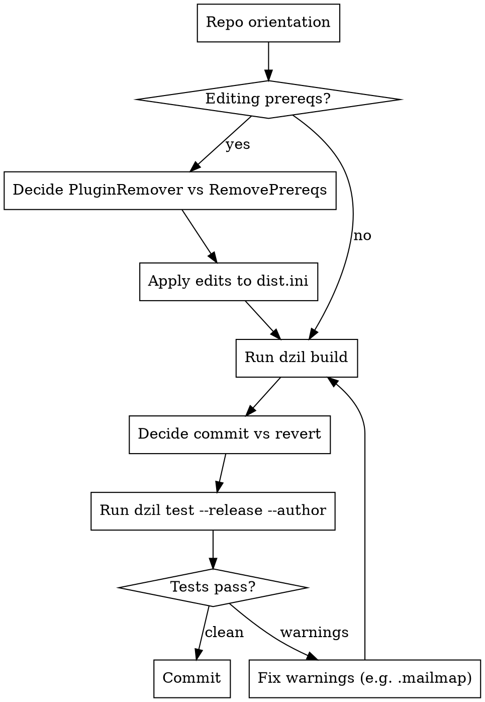

# Working with Dist::Zilla Repositories

## Overview

`Dist::Zilla` (`dzil`) is a meta-tool that builds CPAN distributions from a `dist.ini` declaration. Many of its behaviors are stable across projects but invisible to anyone who hasn't been bitten — there's no "the docs say so" moment, you just learn by getting them wrong. This skill captures those patterns so you apply them on the first pass instead of discovering each one in an implementer/reviewer loop.

**Worked example that surfaced these patterns in sequence:** [oalders/lwp-consolelogger#56](https://github.com/oalders/lwp-consolelogger/pull/56) (Code::TidyAll → precious migration).

## When to Use

Use this skill when:
- The repo contains a `dist.ini` file at its root
- The user mentions `dzil`, `Dist::Zilla`, `@Author::*` bundles, `cpanfile`, or `META.json`
- You are editing prereqs, swapping plugins, or preparing a release
- A `dzil build` output is producing diff noise or unexpected warnings

Don't use when:
- The repo is a plain `ExtUtils::MakeMaker` / `Module::Build` distribution with no `dist.ini`
- Work is unrelated to packaging (e.g. editing only `lib/` source code without touching prereqs or build config)

## Workflow



## 1. Repo orientation: read the bundle source

`dist.ini` usually starts with a single `[@Author::Foo]` line. The bundle's plugin and prereq-block names are what you'll need to reference for `-remove`. Find the bundle source:

```bash
perldoc -lm Dist::Zilla::PluginBundle::Author::OALDERS
```

Read the `configure` / `bundle_config` sub. The strings you can `-remove` against come from there — both plugin instance names (e.g. `Test::TidyAll`) and named Prereqs blocks (e.g. `'Prereqs' => 'Modules for use with tidyall'`).

## 2. Editing prereqs: PluginRemover vs RemovePrereqs

`Dist::Zilla::Role::PluginBundle::PluginRemover` matches `-remove` values against the plugin **instance name** or the **expanded class**. Class-name removes (`-remove = Test::TidyAll`) work reliably because they match `Dist::Zilla::Plugin::Test::TidyAll` — that string is stable. Instance-name removes against a **named Prereqs block** like:

```perl
[ 'Prereqs' => 'Modules for use with tidyall' => { ... } ]
```

…require you to know the exact moniker the bundle assigned. Bundle authors pick these names ad-hoc, so the same conceptual block is called `'Modules for use with tidyall'` in `@Author::OALDERS` but might be `'TidyAll prereqs'` in another bundle. The moniker may also include spaces, slashes, or the `@Bundle/` prefix, none of which is documented anywhere except the bundle source. **Prefer module-level removal via `[RemovePrereqs]` (next section) — it sidesteps the moniker-guessing problem entirely.**

**Decision tree:**

| Target | Use |
|--------|-----|
| A plugin (e.g. `Test::TidyAll`) | `[@Author::Foo]` with `-remove = Test::TidyAll` |
| Individual modules from a bundle's prereqs | `[RemovePrereqs]` (see below) |
| A named `[Prereqs / NAME]` block | `[RemovePrereqs]` — `-remove` is unreliable |

## 3. `[RemovePrereqs]` syntax: `remove =`, not `-remove =`

`[RemovePrereqs]` uses `remove =` (no leading dash). Using `-remove =` raises `multiple values given for property -remove` from `Config::MVP`. This contradicts the muscle-memory pattern from PluginBundle `-remove`. Correct usage:

```ini
[RemovePrereqs]
remove = Code::TidyAll
remove = Code::TidyAll::Plugin::SortLines::Naturally
remove = Parallel::ForkManager
remove = Test::Vars
```

## 4. Re-adding prereqs: `[Prereqs / PHASE]`

After stripping bundle prereqs, re-add what you still need with a phase-scoped block. The slash syntax sets the phase + relationship in one shot:

```ini
[Prereqs / DevelopRequires]
App::perlvars = 0

[Prereqs / TestRequires]
Test::Deep = 0
```

Use `RuntimeRequires`, `TestRequires`, `DevelopRequires`, `ConfigureRequires` as appropriate.

## 5. What to commit vs revert: the `CopyFilesFromBuild` rule

`dzil build` regenerates `META.json`, `Makefile.PL`, `README.md` (and sometimes others) via `[CopyFilesFromBuild]`. These files are tracked at the repo root but are essentially **snapshots of the last release**. When a feature PR touches `dist.ini`, the regenerated copies show up as ~100-line diffs of prereq lists, MakeMaker plugin version bumps, and dist-version increments — noise without semantic content.

**Rule:** For non-release PRs, commit ONLY `dist.ini` and `cpanfile`. Revert the rest and remove the build dir:

```bash
git checkout -- META.json Makefile.PL README.md
rm -rf <dist-name>-*/ <dist-name>-*.tar.gz
```

The next release commit regenerates them cleanly.

**Caveat:** If the PR IS a release (version bump in `dist.ini` + `Changes` update), then those files SHOULD ship in the commit.

## 6. `cpanfile` sync is automatic

`[CopyFilesFromBuild]` copies whatever filenames the bundle explicitly lists — it doesn't intrinsically know about `cpanfile`. But most modern bundles configure `[CopyFilesFromBuild] copy = cpanfile` (often alongside `META.json`, `Makefile.PL`, etc.), so the `cpanfile` at the repo root is regenerated automatically after `dzil build`. You usually don't need to `cp` manually. Verify with:

```bash
diff -u cpanfile <Dist>-*/cpanfile
```

If they differ, run `dzil build` again — your edit hasn't been reflected yet.

## 7. Common warning: `Git::Contributors` → `.mailmap`

`dzil build` emits warnings via `@Author::OALDERS/Git::Contributors` (or any bundle that runs the plugin) when commit history has duplicate author identities — usually case-different emails, or one person committing under multiple addresses. Fix with a `.mailmap` at the repo root:

```
Canonical Name <canonical@email> <duplicate@email>
Canonical Name <canonical@email> <Duplicate@Email>
```

Verify the warnings are gone by inspecting the deduplicated identity list:

```bash
git log --use-mailmap --format='%aN <%aE>' | sort -u
```

## 8. Verification: `dzil test --release --author`

Always run author + release tests before committing `dist.ini` changes:

```bash
dzil test --release --author
```

This catches:
- Missing prereqs after removing plugins (e.g. `Test::Code::TidyAll` left behind after removing the tidyall plugin)
- Broken POD / spelling / pod-syntax tests
- `xt/release-*.t` files generated by plugins you've since removed (delete them as part of the change)

If the tests fail because a generated `xt/release-*.t` references a plugin you removed, delete the test file — it was a build artifact of the old bundle config.

## 9. Sandbox considerations

Two `dzil` quirks bite inside restricted execution sandboxes:

**`dzil test --release --author` needs network sockets and home-dir writes.** It uses `Net::EmptyPort` and writes to paths like `~/.dataprinter`. Sandboxes often block both. If the tests can't run inside the sandbox, run them outside and report results back.

**`dzil` reads `~/.dzil` (often a symlink into dotfiles).** Granting read access to the symlink alone is not enough — the sandbox needs to follow the link to its target. For `nono` sandboxes specifically, that means adding a read grant for the resolved path:

```
--read /home/<user>/dot-files/dzil
```

(Adjust the path to wherever `readlink ~/.dzil` actually points.) Other sandboxes need the equivalent: Bubblewrap wants `--ro-bind <target> <target>`, Firejail wants `--read-only=<target>`, Docker needs the target mounted, etc. The principle is the same — grant access to the symlink TARGET, not just the link.

## Common Mistakes

| Mistake | Fix |
|---------|-----|
| Committing regenerated `META.json` / `Makefile.PL` / `README.md` in a non-release PR | Revert them; the next release commit regenerates cleanly |
| Using `-remove = Modules for use with tidyall` on a named Prereqs block | Use `[RemovePrereqs]` with module-name `remove =` lines instead |
| `-remove = Code::TidyAll` inside `[RemovePrereqs]` | It's `remove =` (no dash) inside `[RemovePrereqs]`; the dash form is only for PluginBundles |
| Adding a prereq with `[Prereqs]` and wondering why it's a runtime dep | Use `[Prereqs / DevelopRequires]` (or `TestRequires`, etc.) to scope the phase |
| Manually copying `cpanfile` from build dir | `[CopyFilesFromBuild]` already does it; just re-run `dzil build` |
| Skipping `dzil test --release --author` | Author tests catch removed-prereq leftovers and stale `xt/` tests |
| Ignoring `Git::Contributors` warnings | Add a `.mailmap`; cheap, one-time fix |
| Guessing at bundle plugin names | `perldoc -lm Dist::Zilla::PluginBundle::Author::Foo` and read the source |

## Red Flags

- **PR diff has ~100 lines of `META.json` / `Makefile.PL` churn** → you forgot the revert step; this is build-output noise
- **`multiple values given for property -remove`** → you used `-remove =` inside `[RemovePrereqs]`; drop the dash
- **`-remove` against a named Prereqs block silently does nothing** → use `[RemovePrereqs]` with module names instead
- **`dzil test --release --author` passes but `dzil build` warns about Git::Contributors** → add a `.mailmap`
- **`xt/release-*.t` failing for a plugin you removed** → delete the stale test file, it was a build artifact
- **Sandbox: `Cannot read ~/.dzil`** → grant read access to the symlink TARGET, not just `~/.dzil`

## Related

- [Dist::Zilla on metacpan](https://metacpan.org/pod/Dist::Zilla)
- [Dist::Zilla::Plugin::RemovePrereqs](https://metacpan.org/pod/Dist::Zilla::Plugin::RemovePrereqs)
- [Dist::Zilla::Role::PluginBundle::PluginRemover](https://metacpan.org/pod/Dist::Zilla::Role::PluginBundle::PluginRemover)
- [gitmailmap(5)](https://git-scm.com/docs/gitmailmap) — `.mailmap` format reference
